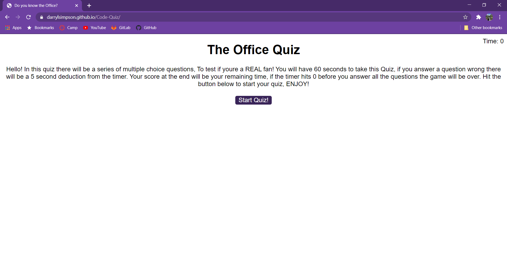
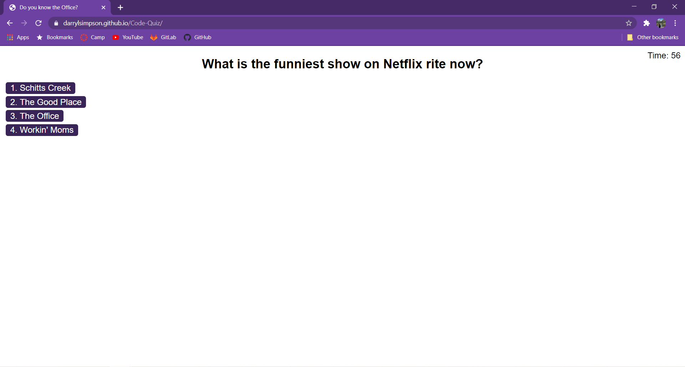
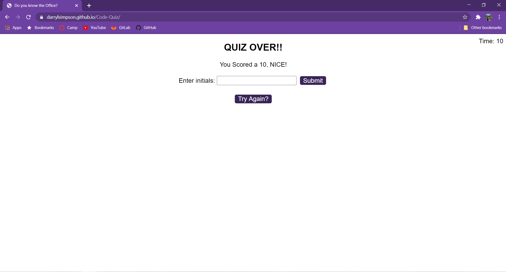
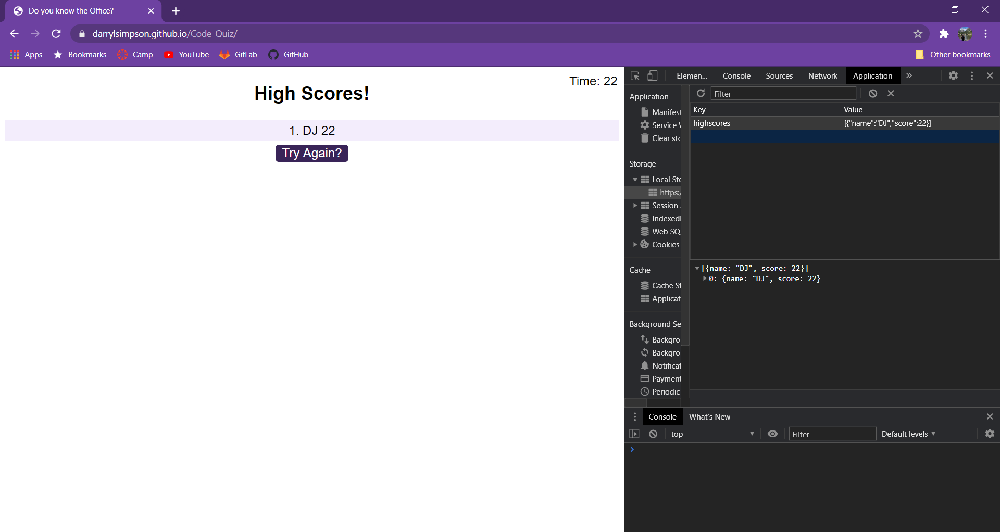

# Code Quiz

## What My Page Does

* WHEN you click the start button
* THEN a timer starts and you are presented with the first question and answers
* WHEN you answer a question 
* THEN another question will appear
* IF you answer a question wrong
* THEN time in the amount of 5 seconds, is subtracted from the timer clock and youll be directed to the next question 
* WHEN all questions have been answered or the timer hits "0" 
* THEN the game is over 

* Once the game is over you will be presented with a screen to save your score with your initials
* WHEN you click "TRY AGAIN"
* THEN you will be able to run through the quiz again and save another score, and have it be saved to local storage

## Code I Used

* I used a combination of HTML, CSS, and mostly JavaScript to do everything I needed on this page.

## Images of My Page

### Link to my page Below

[Link to page](https://darrylsimpson.github.io/Code-Quiz)

### Creator Info

This was created by Me, Darryl Simpson 
Feel free to contact me at [Darryl.Simpson0793@gmail.com](mailto:Darryl.Simpson0793@gmail.com)